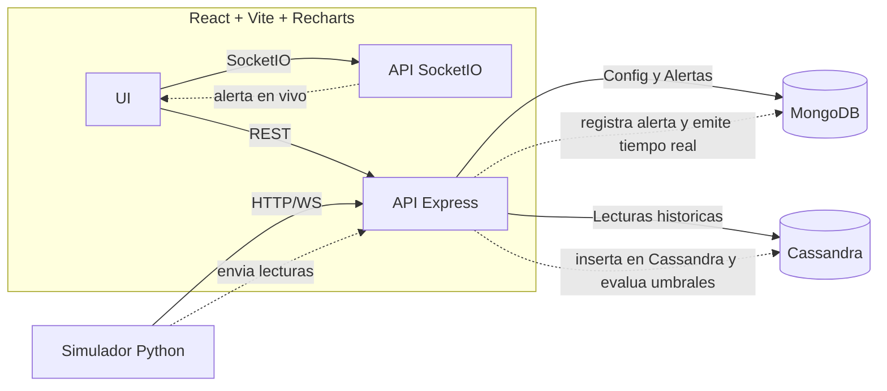

# 🌱 GreenData — README

## 0) Premisa del taller
Desarrollaremos una **plataforma web** para monitorear hasta **100 plantas** con sensores de **humedad, pH, temperatura y luminosidad**.  
El sistema **recibe lecturas en tiempo real**, **genera alertas** (normal, grave, crítica), permite **gestionar plantas/sensores/umbrales** y **visualizar históricos** con gráficos.  
Exigencias académicas: **separación front/back/datos** y uso de **al menos dos bases de datos NoSQL** de distinta categoría.

---

## 1) Tecnologías que vamos a ocupar

### Front-end
- **React + Vite** — construcción de la interfaz rápida y modular.
- **Recharts** — gráficos interactivos para históricos.
- **Socket.IO (cliente)** — alertas y últimos valores en tiempo real.

### Back-end
- **Node.js + Express** — API REST para CRUD y consultas.
- **Socket.IO (servidor)** — canal de tiempo real hacia el front.
- **JavaScript con TypeScript** — tipado estático para mayor mantenibilidad y seguridad.

### Bases de datos NoSQL
- **MongoDB (documental)** — configuración (plantas, sensores, umbrales) y **bitácora/alertas**.
- **Apache Cassandra (wide-column)** — **telemetría** de lecturas, optimizada para consultas por **tiempo** y **alto volumen**.

### Soporte y entorno
- **Docker Compose** — orquestación local (API, front, MongoDB, Cassandra).
- **Python (scripts/simulador)** — generación de lecturas y pruebas de carga (p. ej., lotes de 10.000).

---

## 2) ¿Cómo se comunica cada tecnología y qué función cumple?

- **React (UI) ⇄ Express (API REST)**  
  - La UI realiza **CRUD** de plantas/sensores/umbrales y pide **históricos** (filtros: planta, sensor, rango de fechas).
- **React (UI) ⇄ Socket.IO (API)**  
  - La UI **escucha** eventos `alerts:new` (notificaciones), y opcionalmente `readings:new` (últimos valores para “cards”).
- **Express ⇄ MongoDB**  
  - **Config** y **alertas**: colecciones `plants`, `sensors`, `thresholds`, `alerts`.  
  - Índices para consultas rápidas: `sensors(plantId)`, `alerts(plantId, ts)`.
- **Express ⇄ Cassandra**  
  - **Lecturas**: tabla `readings` particionada por `(plant_id, sensor_type, ymd)` con clustering por `ts DESC`, soporta rangos temporales eficientes.
- **Simulador Python ⇄ Express**  
  - Envía lecturas (unitarias o en lote). La API valida, **inserta en Cassandra**, evalúa umbrales y **emite alertas** por Socket.IO.

**Resumen de roles**
- **React**: experiencia de usuario (panel, formularios, gráficos).
- **Express (Node+TS)**: capa de negocio (ingesta, reglas de alerta, endpoints).
- **MongoDB**: verdad de **configuración** y **registro** de alertas.
- **Cassandra**: **histórico** masivo de lecturas temporalmente consultable.
- **Socket.IO**: tiempo real para una UX reactiva.
- **Docker Compose**: levantar todo con un comando.
- **Python**: simular cargas para pruebas/demos.

---

## 3) Arquitectura en capas

### Arquitectura  (2 servicios + 2 NoSQL)
- **Front-end (React + Vite)**: UI de gestión y visualización.
- **API única (Node.js + Express + Socket.IO, TypeScript)**:  
  - **Ingesta** de lecturas (lote/individual).  
  - **Cálculo de alertas** con histéresis simple (evita “parpadeo”).  
  - **CRUD** de plantas/sensores/umbrales (MongoDB).  
  - **Consultas históricas** a Cassandra con downsampling si hay muchos puntos.  
  - **Emisión** de alertas en tiempo real por Socket.IO.

**¿Por qué esta arquitectura?**
- **Curva de aprendizaje suave** : pocas piezas, responsabilidades claras.
- **Cumple el ramo**: separación front/back/datos y 2 NoSQL de categorías distintas.

---


## 4) Modelos de datos (mínimos)

**MongoDB (documental)**
- `plants { _id, name, location, createdAt, status }`
- `sensors { _id, plantId, type: 'humidity'|'ph'|'temp'|'lux', intervalSec, enabled, meta }`
- `thresholds { _id, sensorId, min, max, hysteresis }`
- `alerts { _id, plantId, sensorId, level: 'normal'|'grave'|'critica', ts, value, message }`

**Cassandra (wide-column)**
```sql
CREATE TABLE readings (
  plant_id uuid,
  sensor_type text,   -- 'humidity'|'ph'|'temp'|'lux'
  ymd date,           -- partición por día
  ts timestamp,       -- clustering
  sensor_id uuid,
  value double,
  PRIMARY KEY ((plant_id, sensor_type, ymd), ts, sensor_id)
) WITH CLUSTERING ORDER BY (ts DESC);
```
## 5) Docker: qué es, cómo funciona aquí y para qué sirve

**¿Qué es?**  
Docker empaqueta tu aplicación y sus dependencias en una **imagen**.  
Al ejecutar una imagen, obtienes un **container**, un proceso aislado y reproducible.

**¿Cómo funciona aquí?**  
Usamos **Docker Compose** para definir y levantar todos los servicios juntos:

- `frontend` → contenedor con React/Vite sirviendo la UI.  
- `api` → contenedor con Express/Socket.IO (Node + TypeScript).  
- `mongo` → contenedor con MongoDB.  
- `cassandra` → contenedor con Apache Cassandra.  

Compose crea una **red interna** donde los servicios se resuelven por **nombre** (DNS interno).  

Ejemplos de conexión desde la API:  
- `MONGO_URI=mongodb://mongo:27017/greendata`  
- `CASSANDRA_CONTACT_POINTS=cassandra`  

Además define **volúmenes persistentes**:  
- `mongo_data:/data/db`  
- `cassandra_data:/var/lib/cassandra`  

Así los datos **no se pierden** al reiniciar los contenedores.

**¿Para qué sirve en este proyecto?**  
- **Reproducibilidad**: todos corren con las mismas versiones.  
- **Aislamiento**: evita conflictos con dependencias locales.  
- **Simplicidad**: un solo comando levanta front, back y BDs.  
- **Portabilidad**: la app funciona en cualquier máquina con Docker.  

---

## 6) Flujo de datos (diagrama)



## 7) Estructura de carpetas del proyecto

La organización del repositorio sigue la arquitectura en capas (front, back y datos), junto con scripts de soporte.  
Cada carpeta contiene su propio `package.json` (frontend y backend) para mantener dependencias aisladas.

## 📂 Estructura del proyecto

La organización del repositorio **GreenData** sigue la arquitectura en capas (front-end, back-end y almacenamiento), más un simulador para pruebas.

```bash
greendata/
backend/
│
├── src/
│   ├── api/
│   │   ├── index.ts              # Registro de rutas y middlewares
│   │   ├── plants.controller.ts  # CRUD de plantas y sensores
│   │   ├── readings.controller.ts# Lecturas históricas
│   │   ├── alerts.controller.ts  # Listado de alertas
│   │   └── health.controller.ts  # Healthcheck /api/health
│   │
│   ├── services/
│   │   ├── ingest.service.ts     # Procesa lecturas entrantes
│   │   ├── alert.service.ts      # Evalúa umbrales y genera alertas
│   │   ├── plant.service.ts      # Lógica de negocio para plantas
│   │   └── schedule.service.ts   # Interpreta modos predefinida/horario/rango
│   │
│   ├── models/
│   │   ├── plant.model.ts        # Esquema MongoDB de plantas
│   │   ├── sensor.model.ts       # Esquema MongoDB de sensores
│   │   ├── alert.model.ts        # Esquema MongoDB de alertas
│   │   └── reading.model.ts      # Modelo de lectura (si usas Mongo)
│   │
│   ├── sockets/
│   │   ├── index.ts              # Configuración de Socket.IO
│   │   ├── alerts.socket.ts      # Emisión de alertas
│   │   └── readings.socket.ts    # Emisión en tiempo real de sensores
│   │
│   ├── db/
│   │   ├── mongo.ts              # Conexión a MongoDB
│   │   └── cassandra.ts          # Conexión a Cassandra
│   │
│   ├── utils/
│   │   ├── logger.ts             # Winston o consola estructurada
│   │   ├── env.ts                # Validación de variables de entorno
│   │   ├── errors.ts             # Clases de error custom
│   │   └── time.ts               # Fechas, ISO, zonas horarias
│   │
│   ├── config/
│   │   ├── cors.ts               # CORS dinámico
│   │   ├── express.ts            # Configuración base de Express
│   │   └── socket.ts             # Setup de Socket.IO con namespaces opcionales
│   │
│   ├── app.ts                    # Inicializa Express + Socket.IO
│   └── server.ts                 # Punto de entrada principal
│
├── tests/
│   ├── api/
│   ├── services/
│   └── utils/
│  └─ package.json
│
├─ simulator/                  # Scripts en Python para simular sensores
│  └─ send_batch.py
│
├─ docker-compose.yml           # Orquestación de contenedores (api, frontend, mongo, cassandra)
├─ README.md
└─ .env                         # Variables de entorno compartidas
```

**Notas importantes:**
- **api/db** → contiene los drivers y configuraciones de conexión a **MongoDB** y **Cassandra**.  
- **api/services** → implementa la lógica de CQRS:  
  - MongoDB → configuración y alertas.
  - Cassandra → lecturas históricas.  
- **frontend/services** → centraliza llamadas a la API REST y manejo de sockets en React.  
- **simulator** → útil para pruebas de carga y demostraciones académicas.  
- **docker-compose.yml** → permite levantar todo el entorno con un solo comando.

---
